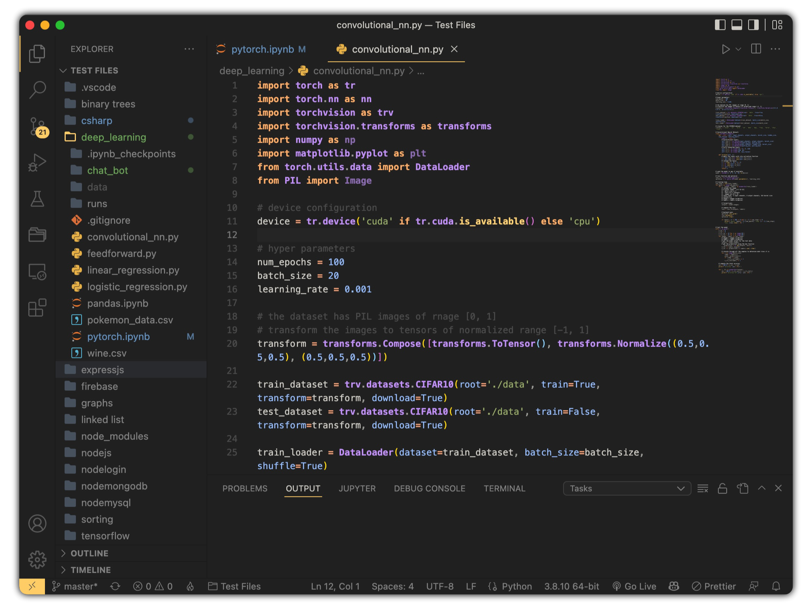
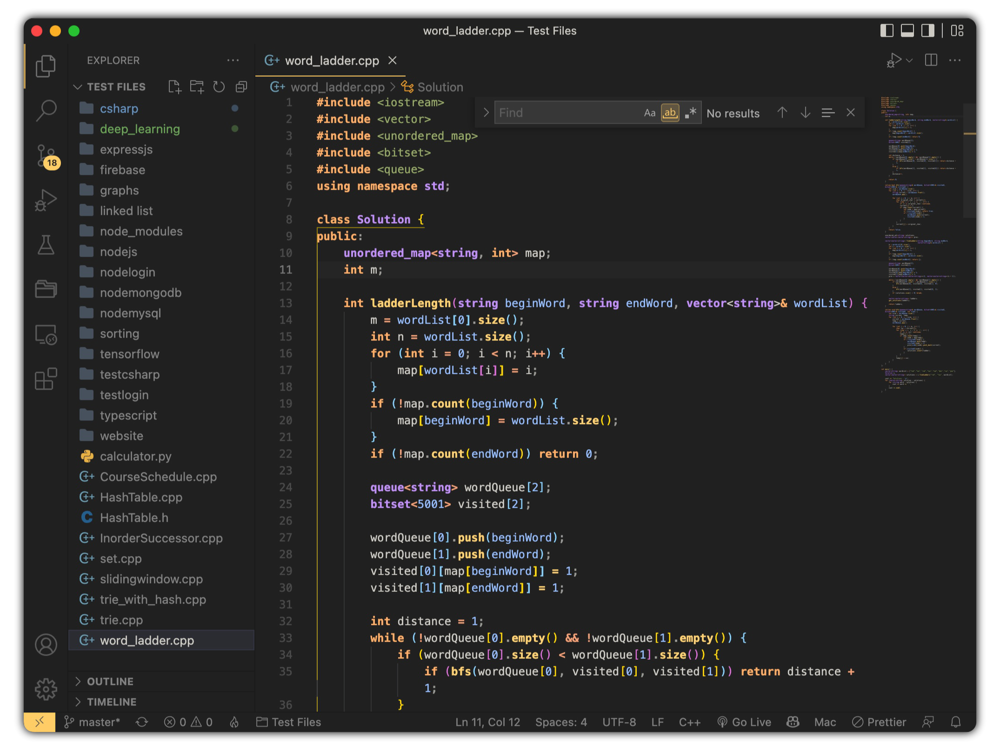
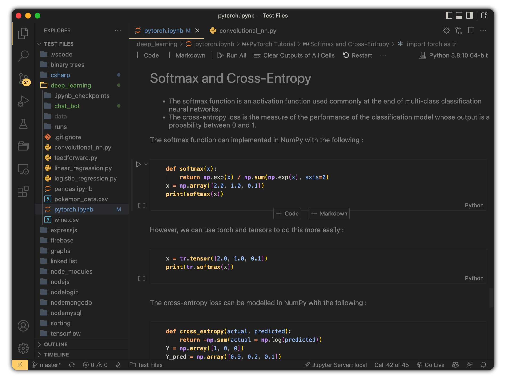
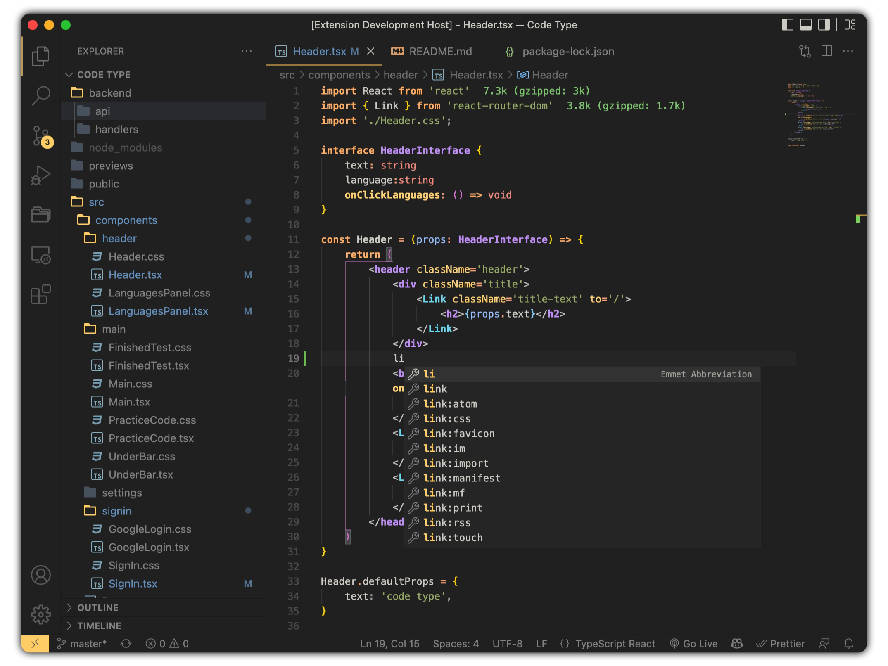
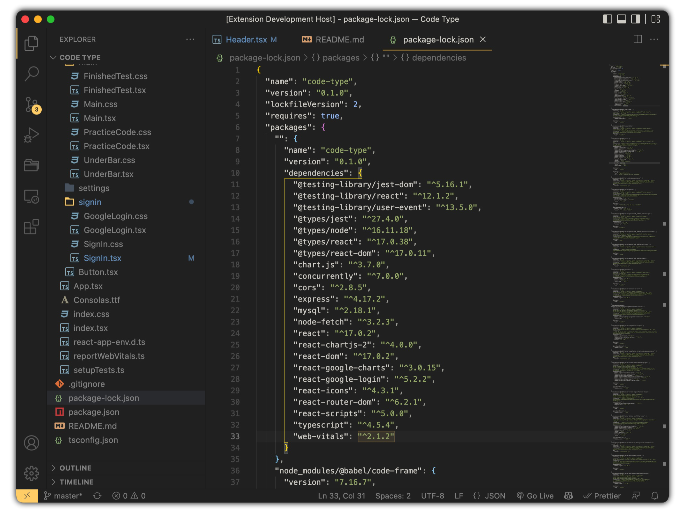
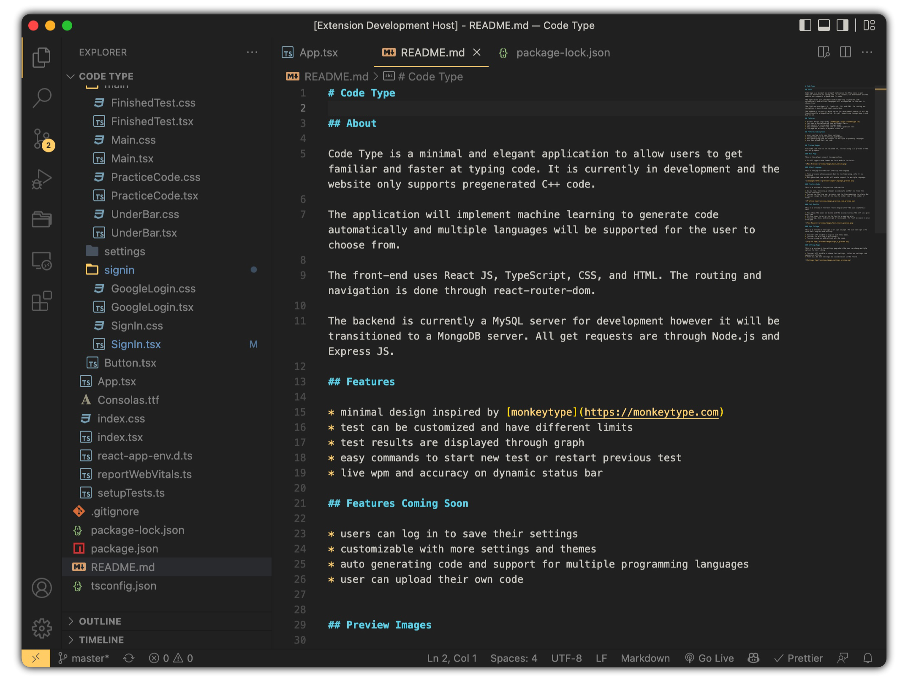

# Matte Black Theme

A clean matte black visual studio code theme inspired by the [ayu theme](https://marketplace.visualstudio.com/items?itemName=teabyii.ayu) package and the [drake-ayu](https://theme.typora.io/theme/Drake/) typora theme.  

## Preview Images

### C++ Preview

### Python Notebook

### TypeScript Preview

### Json Preview

### Markdown Preview

## Links

* github : [matte-black-theme](https://github.com/yug2005/matte-black-theme)
* author : [yug-sahu](https://github.com/yug2005/)
* contact : [mail](mailto:yugtesh88@gmail.com)